# Project: Neural network potentials for Lennard-Jones clusters

We develop a neural network (NN) potential for small Lennard-Jones (LJ) clusters. There will be three steps that will be worked on :

- Setting up the LJ clusters and creating several datasets
  - Initial cluster setup
  - Optimising cluster setup
  - Creating datasets using Monte Carlo sampling
    - MC sampling and dataset for 3D LJ cluster
    - MC sampling and dataset for 2D LJ cluster
- Optimizing the hyper-parameters and training the NN
  - Network architecture and weight optimization
  - Learning curve with respect to dataset size
- Application, transferability, and limitations
  - Use the fitted NN to perform Monte Carlo (MC) sampling of the 3D clusters
  - Transferability of the NN potential
    - Low and high temperature data
    - Fitting with mixed datasets or including all datasets
    - Transferability from 3D to 2D

## 1. Setting up the LJ clusters and creating several datasets

To setup the cluster structures and evaluate the LJ potential, we use the ‘Atomic Simulation Environment’ (ASE, https://wiki.fysik.dtu.dk/ase/), a set of Python tools for atomistic simulations.

### 1.1 Setting up 2D and 3D clusters with 7 atoms

We create atom objects for 2 cluster. Both clusters consist of 7 atoms.  
**For the 2D cluster**, we place the central atom at the origin and the other 6 atoms on the vertices of a hexagon around the central atom in the xy-plane.  
**For the 3D cluster**, we place the central atom again at the origin and the other 6 atoms on the vertices of an octahedron. We set the initial distance between the central atom and its 6 neighbours to 1.1 Angstrom.

### 1.2 Optimizing the initial cluster structures

To optimise the initial positions of the atoms in the two clusters by minimising the forces, we use the **BFGS minimizer** in ASE (https://wiki.fysik.dtu.dk/ase/ase/optimize.html? highlight=bfgs#ase.optimize.BFGS) and perform an energy minimization with a maximum force of 0.05.

- For 2D cluster, to apply constraints to the xy-plane, we use ase.FixedPlane constraint in ASE
- Visualize the clusters: using ase.visualize.view
- to calculate Pairwise distances : get_all_distances() of cluster object in ase

<table align="center" style="margin-left: auto; margin-right: auto; text-align: center; border-collapse: collapse;">
  <tr>
    <td style="padding: 10px;">
      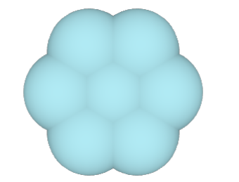 
      <b>Optimised 2D cluster</b>
    </td>
    <td style="padding: 10px;">
      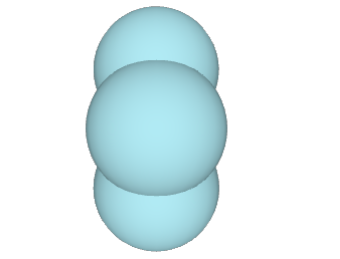 
      <b>Optimised 2D cluster</b>
    </td>
  </tr>
  <tr>
    <td style="padding: 10px;">
      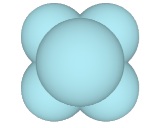 
      <b>Optimised 3D cluster</b>
    </td>
    <td style="padding: 10px;">
      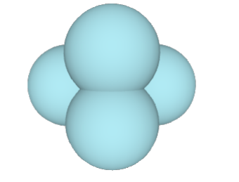 
      <b>Optimised 3D cluster</b>
    </td>
  </tr>
</table>

### 1.3 Creating datasets using Monte Carlo sampling

To train the NN, a number of different configurations of the clusters is required to sample the potential energy surface of the clusters.

#### 1.3.1 Monte Carlo Sampling

We will use Monte Carlo (MC) sampling at different temperatures to create a set of meaningful configurations, that is configurations that have a significant contribution to the partition function in the canonical ensemble.

An MC step consists of two parts:

- propose a trial configuration.
- accept/reject the trial configuration based on the detailed balance criterion. If the trial configuration is rejected, the old configuration is recounted in the ensemble.

How to create a trial configuration?  
To create trial configuration r(n) from the old one r(o), a displacement is added to all atoms in the cluster
$$r_i^{(n)} = r_i^{(o)} + \Delta r \tag{Eq. 1}$$

where the displacements $\Delta r$ are Gaussian distributed random number with 0 mean and a standard deviation $\sigma_G$ (width of the Gaussian, controls the magnitude of the displacement). The acceptance probability for the trial configuration is
$$p_{acc} (o \rightarrow n) = min\left(1, exp(-\beta \left(E_{pot}^{n} - E_{pot}^{o})\right)\right) \tag{Eq. 2}$$
with $\beta = 1/(k_BT)$

An MC step thus includes the following:

1. compute energy of old configuration and save old positions
2. create new configuration by adding a random displacement to all atoms according to Eq. (1)
3. compute energy of new configuration
4. accept/reject new configuration according to Eq. 2

#### 1.3.2 MC sampling and dataset for 3D LJ cluster

The acceptance ratio is the ratio between accepted MC moves and the total number of MC steps, $n_{acc}/n_{MC}$. **A good sampling is usually achieved if the acceptance ratio is around 0.4 − 0.5 and depends on the temperature and the displacement magnitude. For lower T, the displacement magnitude σG has to be chosen smaller to achieve a suitable acceptance ratio**.

- With our initial optimized configuration of the 3D cluster, we run 20,000 MC steps at a temperature T = 10 K. We aim to find such value of $\sigma_G$ such that the acceptance ratio is around 0.5. _We collect configuration at every 20 MC steps, so that your dataset contains a total of 1000 data points_.
- Starting again with the initial optimized configuration, collect another dataset at T = 800 K by making sure to adjust $\sigma_G$. We run again 20 000 MC steps, print the energy every 500 steps and collect your data every 20 steps.

For 3D clusters, we performed MC sampling with below parameters.
| Temprature | Sigma | Acceptance Ratio |
| -------- | -------- | -------- |
| 10 K | 0.001 | 0.493 |
| 800 K | 0.01 | 0.442 |

  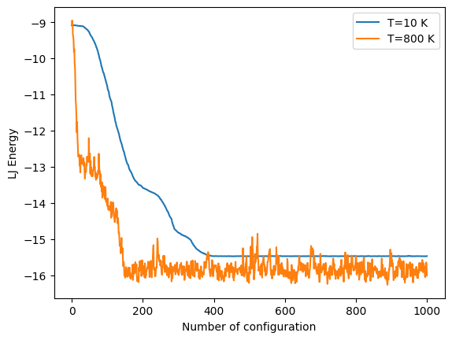

#### 1.3.3 MC sampling and dataset for 2D LJ cluster

We do similar as above but for 2D cluster with below parameters.
| Temprature | Sigma | Acceptance Ratio |
| -------- | -------- | -------- |
| 200 K | 0.005 | 0.485 |
| 2000 K | 0.02 | 0.426 |

  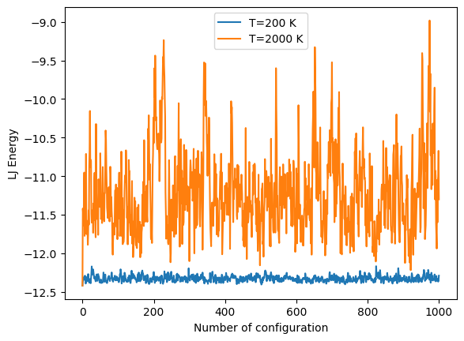

## 2. Optimizing the hyper-parameters and training the NN

### 2.1 Network architecture and weight optimization

We use the datasets created in the first part to fit a NN that can predict the energy of the LJ clusters. As a first step we optimize the architecture of the NN (number of hidden layers, number of nodes/hidden layer, and activation function) and check the optimization of the weights with different solvers. We use the class MLPRegressor imported from sklearn.neural_network.

### 2.1.1 Optimizer

The weights of the NN are initialized randomly. The same set of initial weights for a given architecture can be obtained by setting the variable random_state. The variable warm_start can be used to reuse the solution of a previous fit.

We compare the performance of different optimizers to fit the weights. We use warm_start=’false’ and use an NN with 2 hidden layers and 10 nodes/hidden layer. We fit the data for the 3D LJ cluster at T = 800 K using the ‘adam’ and the ‘lbfgs’ solver for two different sets of initial weights.

We split the dataset into 80 % training and 20 % test data. To make sure the same set of initial weights is used for both optimizers, we specify the random_state in the MLPRegressor.

In total, we have 4 different fits: We pick two values for the random_state and optimize each of the two initial sets of weights with both the ‘adam’ and ‘lbfg’ solver.

Later we compute and report the coefficient of determination (R2) for the test dataset and the MSE and MAE for the training and test set. We also report the number of iterations steps for each solver and show which of the two solvers performs better for the current problem. We get below results.

| Solver         | MSE Train | MAE Train | MSE Test | MAE Test | R$^2$ score | num of iteration |
| :------------- | --------: | :-------: | -------: | :------: | :---------: | :--------------: |
| Adam Solver 1  |     0.045 |   0.152   |    0.050 |  0.160   |    0.948    |       1930       |
| lbfgs Solver 1 |     0.007 |   0.063   |    0.006 |  0.059   |    0.994    |       481        |
| Adam Solver 2  |     0.075 |   0.180   |    0.073 |  0.174   |    0.925    |       1156       |
| lbfgs Solver 2 |     0.007 |   0.065   |    0.006 |  0.061   |    0.994    |       252        |

**Our results shows lbfgs solver perform good for both cases of different weights ininitation having less MSE and MAE**

### 2.1.2 Hidden layer nodes

Now, we explore "How MSE depends on number of hidden layers and respective nodes". To do so, we take again the dataset for the 3D LJ cluster at T = 800 K and split the dataset into 80 % training and 20 % test data. Use an ‘lbfgs’ solver and the ‘logistic’ activation function.

First, we Fit a series of NNs with one hidden layer and 1 − 100 nodes in steps of 10, determine the MSE in the training and test set and plot the MSE as a function of the number of nodes.Please note a logarithmic scale for the y-axis is used.

We fit another series of NNs with two hidden layers and 1 − 15 hidden nodes/layer. Determine again the MSE in the training and test set and plot the MSE as a function of the number of nodes/layer. Use a logarithmic scale for the y-axis.

We get below reults

| Solver                     | NN type | Optimial number of hidden nodes with Minimum MSE Test | Minimum MSE Test |
| :------------------------- | ------: | :---------------------------------------------------: | ---------------: |
| lbfgs solver with Logistic |    1-NN |                          50                           |           0.0027 |
| lbfgs solver with Logistic |    2-NN |                          11                           |           0.0028 |

<table align="center" style="margin-left: auto; margin-right: auto; text-align: center; border-collapse: collapse;">
  <tr>
    <td style="padding: 10px;">
      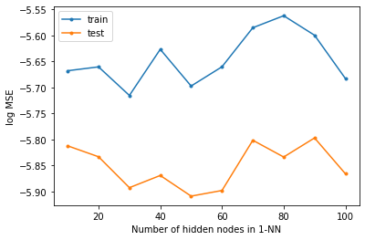 
      <b>NN with 1 hidden layers</b>
    </td>
    <td style="padding: 10px;">
      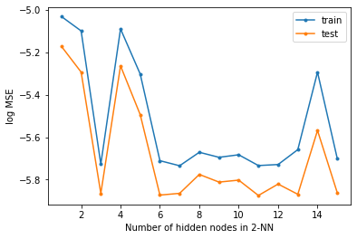 
      <b>NN with 2 hidden layers</b>
    </td>
  </tr>
</table>

Here 1-NN with 5 nodes gives lesser MSE with respect to 2-NN but we see there are number of nodes in 2-NN architecture for which MSE is in same range and generalises well with a wide number of hidden nodes. 2-NN architecture will be more flexible to other inputs and perform well if the number of data increases.  
**I think a 2-NN architecture with 11 number of nodes should be selected.**

### 2.1.3 Activation function

Now, we compare results with respect to activation functions. Instead of the ‘logistic’ activation function we now use the ‘relu’ activation function.

| Solver                 | NN type | Optimal number of hidden nodes (Minimum MSE Test) | Minimum MSE Test |
| :--------------------- | ------: | :-----------------------------------------------: | ---------------: |
| lbfgs solver with relu |    1-NN |                        60                         |          0.00278 |
| lbfgs solver with relu |    2-NN |                        13                         |          0.00275 |

<table align="center" style="margin-left: auto; margin-right: auto; text-align: center; border-collapse: collapse;">
  <tr>
    <td style="padding: 10px;">
      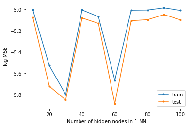 
      <b>NN with 1 hidden layers</b>
    </td>
    <td style="padding: 10px;">
      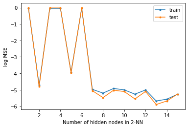 
      <b>NN with 2 hidden layers</b>
    </td>
  </tr>
</table>

The gap between traing and test samples is very less in relu activation function but it shows very less gap for even small number of nodes as well which can be doubtful. On the other-hand, the gap between test and training in case of "logistic function" is consistent.  
**Therefore, we think that 2-NN (lbfgs solver with logistic) should be prefered.**

### 2.1.4 Size of training dataset

To determine the number of training data needed to converge the error in the test set, we use an NN with 2 hidden layers, 10 nodes/hidden layer, a logistic activation function, and an lbfgs solver.

For each of the four datasets (2D LJ clusters at T = 200 K and 2000 K, 3D LJ clusters at T = 10 K and 800 K),

- we select 20 % test data (200 data points)
- from the remaining 800 data points, we randomly choose 20, 50, 100, 200, 300, 400, 500, 600, 700, 800 data points as training set.
- we fit an NN for each size of the training dataset and determine the MSE and R2 in the test set.
- we plot the MSE and the R2 as a function of the number of training data for each of the four datasets to determine the minimum number of training data needed to obtain a converged fit.

<table align="center" style="margin-left: auto; margin-right: auto; text-align: center; border-collapse: collapse;">
  <tr>
    <td style="padding: 10px;">
      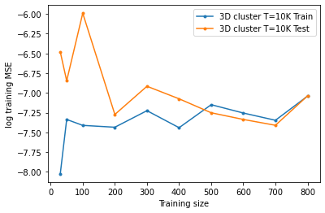 
      <b>3d Cluster T= 10 K</b>
    </td>
    <td style="padding: 10px;">
      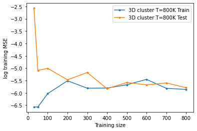 
      <b>3d Cluster T= 800 K</b>
    </td>
  </tr>

  <tr>
    <td style="padding: 10px;">
      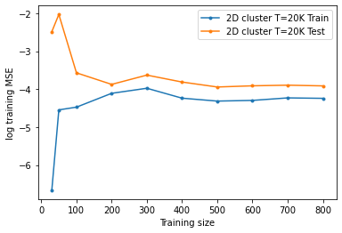 
      <b>2d Cluster T= 20 K</b>
    </td>
    <td style="padding: 10px;">
      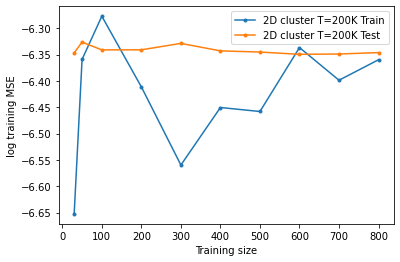 
      <b>2d Cluster T= 200 K</b>
    </td>
  </tr>
</table>

**All above plots shows that we should have at least 200 number of training samples from where difference between the training and test set is not wide.**

## 3. Application, transferability, and limitations

Now, we want to use a fitted NN to perform Monte Carlo (MC) sampling of the 3D clusters.

Applying the NN potential in an actual simulation will require a certain accuracy and robustness of the potential. In particular, it is important to check that the created structures are still within the space the NN has been fitted in, as these potential are good for interpolation but, due to the lack of any physical meaning, they cannot be used for extrapolation.

It is important for both the MC sampling and the NN fitting, to make our results reproducible, we should initialize our random number generator with a specific seed (np.random.default_rng(seed)) for the MC sampling and specify a random_state in both ShuffleSplit for creating the training and test set and in MLPRegressor to initialize the weights.

### 3.1 Fitting the initial NN

We use the dataset of the 3D LJ clusters at T = 800 K and fit an NN with 2 hidden layers and 10 nodes/layer, a logistic activation function, and an lbfgs solver (similar to our findings in 2nd Part). We split the data into 20 % test und 80 % training set and check the R2 score of the test data, and the MSE and MAE of the training and test datasets.

One way to visualize the quality of the fit is to plot the predicted energy vs. the actual energy. For a ‘perfect’ fit, all data would fall on the diagonal line y = x. we plot the predicted energies as a function of the actual energies in a scatter plot together with the diagonal y = x.

Make sure that the x and y axes have the same range and also the same dimension (so that you have a square plot).

<table align="center" style="margin-left: auto; margin-right: auto; text-align: center; border-collapse: collapse;">
  <tr>
    <td style="padding: 10px;">
      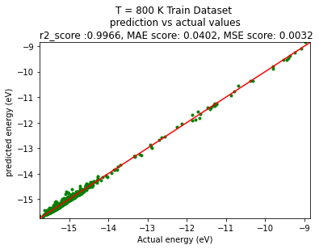 
      <b>Train Set</b>
    </td>
    <td style="padding: 10px;">
      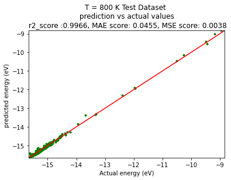 
      <b>Test Set</b>
    </td>
  </tr>
</table>

### 3.2 MC step function using the NN and MC Sampling using NN potential

Now we write a python function that performs an MC step, but instead of using the LJ potential to compute the energy, use the energy predicted by the NN potential.

Now we want to perform MC sampling using the NN potential. We run the simulations for the 3D cluster at T = 800 K and a displacement $\sigma$ = 0.01 for 30 000 MC steps. Every 2000 steps, print and record the energy predicted by the NN potential and the energy of the LJ potential.

We plot both the NN and LJ energy for the configurations along the MC trajectory, that is as a function of the number of steps. We will answer the questions. Is the NN potential suitable to perform the MC sampling? Do the energies of the NN and LJ potential agree?

  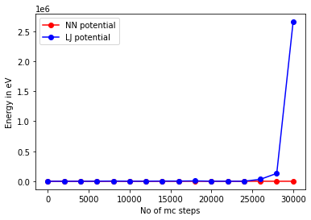 
  <b>Comparison of NN potentials and LJ potentials</b>

The above results shows that most of NN potentials are suitable for MC sampling since their NN potential and LJ potential do not differ very much. But at later stages of mc steps they are tending to deviate.

### 3.3 Refitting the NN potential

Apparently, the NN potential fitted with the initial dataset is not robust enough to perform MC sampling as the MC moves create configurations that are outside the validity range of the potential. So to resolve this problem, the NN potential can be refitted by adding additional configurations encountered during the sampling.

To do so, we use the MC sampling in the previous task with the NN potential and collect additional data every 20 steps. Sometimes, the NN can be really off and the LJ energy of the configurations extremely high. To avoid these artificial configurations, only collect data points if the LJ energy of a configuration is < 0. With this we made 225 data points.

Now, we add the data to the original dataset and refit the NN

<table align="center" style="margin-left: auto; margin-right: auto; text-align: center; border-collapse: collapse;">
  <tr>
    <td style="padding: 10px;">
      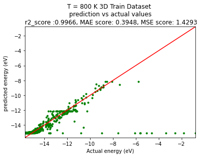 
      <b>Train Set</b>
    </td>
    <td style="padding: 10px;">
      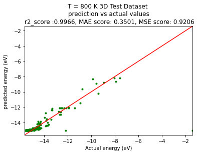 
      <b>Test Set</b>
    </td>
  </tr>
</table>

Now, we perform the MC sampling using fitted NN with extended dataset to check the quality of MC sampling with extended dataset. We get following results.

  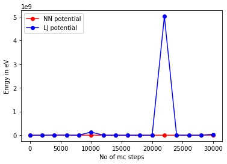 
  <b>Comparison of NN & LJ potentials with extended dataset</b>

**We perform second round of extending the dataset to check if it improves**. We again extend our dataset

  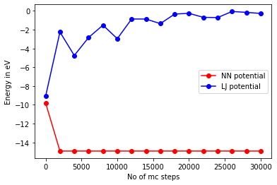 
  <b>Comparison of NN and LJ potentials with extending dataset again </b>

It shows that the mc sampling with second gets better becasue we do not get very high energy values but the difference is still significant.

### 3.4 Transferability of the NN potential

We saw that the validity of the NN potential is restricted to the space covered by the training set. Now, we want to explore how transferable the NN potential is with respect to temperature and dimensions.

#### 3.4.1 Tranferability with respect to Low and high temperature data

- We use a NN with 2 hidden layers and 10 nodes/layer, a logistic activation function, and an lbfgs solver.
- We tit the NN using the dataset of the 3D LJ clusters at T = 10 K with 20 % test and 80 % training data.

- we use the above NN, to check transferablity to higher temprature and predict the energy of the dataset of 3D LJ clusters at T = 800 K, and report the R2 value, the MSE and MAE for the dataset

  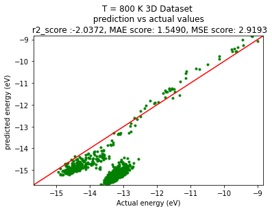 
  <b>Preformance of NN at high Temprature T = 800K</b>

The $r^2$ score is negative and the points have a large variance from Y=X line. So it is not transferable for higher tempratures.

#### 3.4.2 Fitting with mixed datasets

To expand the transferability, the NN can be fitted using data created at different temperatures.

- For the 3D LJ clusters, in addition to the datasets at T = 10 K and 800 K, we create datasets at T = 50 K, 200 K, and 500 K. To do so, we make sure to adjust the displacement to achieve acceptance ratios ≈ 0.5.
- We Combine the four datasets atT =10K,50K,500K, and 800K and fit an NN (same architecture as above) with 20 % test and 80 % training data
- **We use the NN to predict the energy of the dataset of 3D LJ clusters at T = 200 K (which was not included in the training)**

The results are as below

  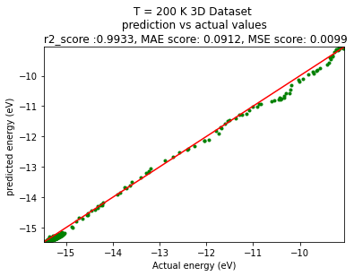 
  <b>Transferability check with mixed dataset </b>

**The above plot shows our network fitted with combined dataset works well for unseen Temprature T = 200 K data which shows our network is showing transferability. Small MSE and high $R^2$ score**.

#### 3.4.3 Transferability from 3D to 2D

By using data at different temperatures we could improve the transferability for the 3D LJ clusters.

- we use the 5 datasets at the different temperatures from the previous task
- We fit an NN (same architecture as above) with 20 % test and 80 % training data.
- We use the NN to predict the energy of the datasets of 2D LJ clusters at T = 200 K and 2000 K

<table align="center" style="margin-left: auto; margin-right: auto; text-align: center; border-collapse: collapse;">
  <tr>
    <td style="padding: 10px;">
      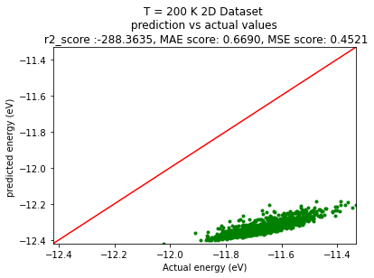 
      <b>T = 200K</b>
    </td>
    <td style="padding: 10px;">
      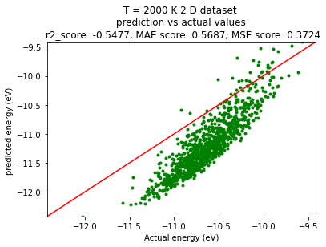 
      <b> T =2000 K</b>
    </td>
  </tr>
</table>

**The NN trained by combining all 3D cluster data is not transferable T= 200k, 2D clusters case and shows some improvemment in transferabilty for 2000k. but overall it does not do a good prediction for 2D cluster.**

#### 3.4.4 Including all datasets

In a final fit,

- **we combine all 5 datasets for the 3D LJ clusters and the 2 datasets for the 2D LJ clusters** and fit an NN (same architecture as above) with 20 % test and 80 % training data.
- Check R2 value, the MSE and MAE for the training and test set, as well as separately for the entire datasets of the 2D LJ clusters at T = 200 K and 2000 K

<table align="center" style="margin-left: auto; margin-right: auto; text-align: center; border-collapse: collapse;">
  <tr>
    <td style="padding: 10px;">
      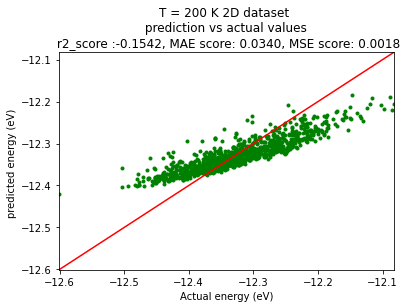 
      <b>T = 200K</b>
    </td>
    <td style="padding: 10px;">
      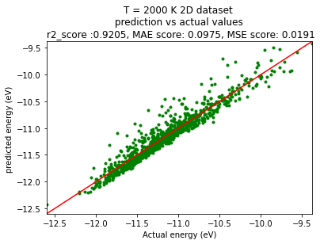 
      <b> T =2000 K</b>
    </td>
  </tr>
</table>

**Based on above plots, we find that the fitted network does a good job for T = 2000 K but for T=200k, it does not predict well.**
